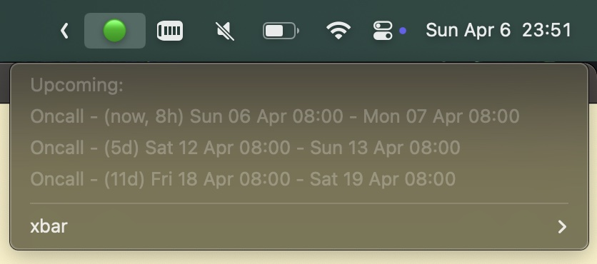

# pagerduty-xbar
[](https://github.com/jakub-m/pagerduty-xbar/actions)
[](https://github.com/jakub-m/pagerduty-xbar/releases)


Show Pager duty status in [xbar][xbar].

[xbar]: https://github.com/matryer/xbar



## Configuration

Requires the following environment variables to work (in `~/.config/pg_xbar.conf`)
- `PG_SCHEDULE_ID` - ID of the schedule, can be take from PagerDuty URL.
- `PG_AUTH_TOKEN` - Authentication token, generate it in PagerDuty settings.
- `PG_USER_ID` - your user ID, available in your profile URL.
- `PG_ICONS` - Optional set of there icons: on-duty, tomorrow-on-duty, not-on-duty.
- `PG_DOMAIN` - An optional PagerDuty domain that will be used in the URLS.

## Running

```
cargo build --relase
./xbar_pagerduty.sh
```

For **development** (when run from within the git repository) the script uses
`cargo run` instead of release target.

## Installation

### From source

```sh
$ git clone git@github.com:jakub-m/pagerduty-xbar.git
$ cargo build --release
$ ln -s $(realpath xbar_pagerduty_plugin.sh) "$HOME/Library/Application Support/xbar/plugins/pagerduty.5m.sh"
```

### Releases
If you don't have the Rust toolchain installed you can also go to [releases][releases] and grab the prebuilt binary. Then you need to extract the files, place them in one directory and execute:

[releases]: https://github.com/jakub-m/pagerduty-xbar/releases

```sh
ln -s $(realpath xbar_pagerduty_plugin.sh) "$HOME/Library/Application Support/xbar/plugins/pagerduty.5m.sh"
```

You can also place `xbar_pagerduty_plugin.sh` in the plugins folder manually, just make sure to change the path pointing to `xbar_pagerduty.sh`.

NOTE: macOS will most likely complain about untrusted binaries. To fix this go to "Privacy & Security" in System Settings and look for a warning in the "Security" section where you can choose to trust the program.

### man pages

There is a `man` page in [./man][./man] directory. To build and test it do:

```
brew install ronn
ronn man/pagerduty-xbar.md  --roff
man ./man/pagerduty-xbar.1
```
